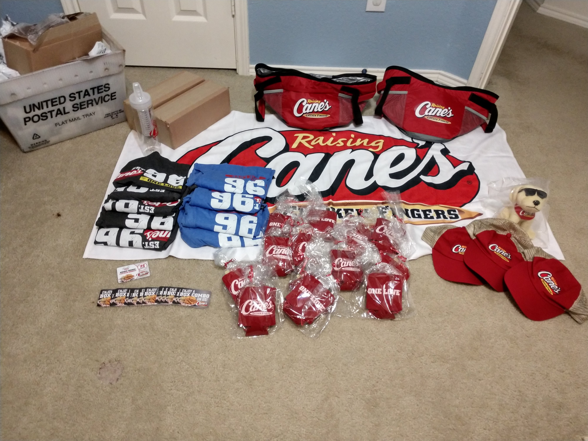
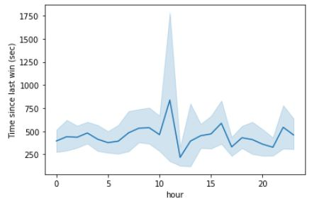
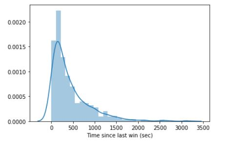
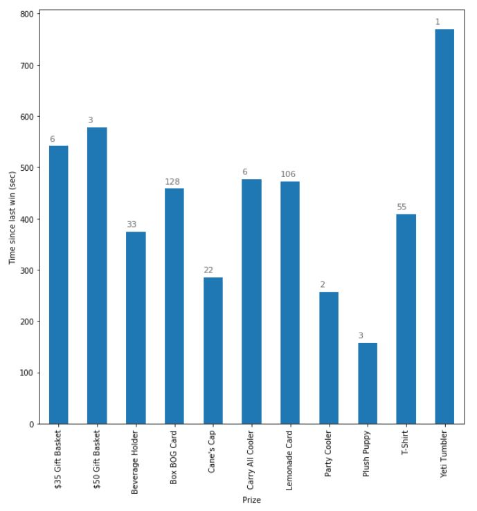
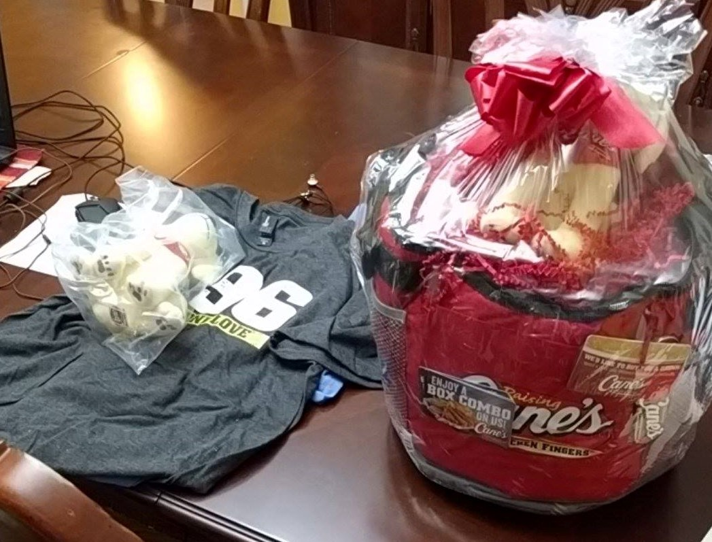
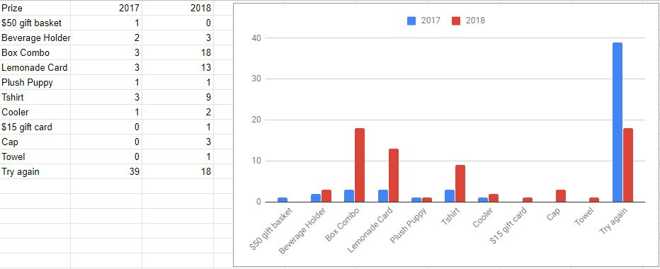

# Cracking Canes

Prize Haul from 2018, totalling in $400 worth of material

Documentation of the path to victory.

Dallas, TX. February 2017. We were 4 seniors at UT Dallas with too much time on our hands. Raising Cane's Chicken Fingers was a favorite establishment of ours, and their annual Peel the Love promotion was ongoing. The promotion was simple:

1. Gain 2 tickets from purchasing a drink at the resturaunt, one of was a puzzle piece for a big reward. The other was a code for an online lottery(for food and merch) or an instant prize.
2. Once a day, gain a code for the online lottery by playing a game on an app.
3. For the online lottery, prizes would be released throughout the day(hidden from user). The first code to be entered after this release would claim the prize.

Sensing an opportunity to win, we decided to all download the app and start playing daily, and enlisted several close friends to help us. Rather than use the codes right away, we stockpiled them in a shared document while we decided to do some analysis on the lottery.

After some research, we discovered that results for the lottery were published online, and seemed to update live. The most experienced [programmer](https://github.com/atvaccaro/) among us built a tool with scrapy and captured the changes to this list over a few days, which became our main data source for analysis.

The full exploration can be found in this [notebook](https://github.com/EZBUTD/Cracking-Canes/blob/master/Exploration%20and%20visualization.ipynb), but the main points of interest we found were:

Overall, prizes were claimed mostly evenly throughout the day

Assuming most prizes were claimed soon after they were released for the lottery:
The mean cooldown time was around 7 minutes, but the majority of prizes were claimed within a 5 minute cooldown.

There seemed to be an uneven cooldown distribution across prizes. Our sample size was relatively small, but in general, better prizes were released after a longer cooldown period.

## Results

2017 was a pretty good start, although a large majority of our tries were unsuccesful. We explored a few strategies, from entering at night(worked very well) to entering on the last day(worked poorly) and different cooldowns(5-10 minutes). Still, we were happy to win anything, and felt rewarded for explorations given the $50 gift basket we won.

When the promotion came around again in 2018, we went for full exploitation. We stuck to a 5 minute cooldown during night and spread out our entries before the last day. Overall, this worked incredibly well for us, leading to our $400 win at the beginning of the post.

In 2019 though, it was apparant that our strategy was noticed. Canes implemented additional rules to block our strategies, limiting entries per account and preventing stockpiling of codes by having them expire soon after generation. While there was certainly opportunity to circumvent these rules with additional scripting, we came to the conclusion that it would be best to stop here. We weren't students anymore and had normal work to deal with on a day to day basis. It was a great run though, with some amazing memories made along the way. Every meal at Canes now, even if it's not free anymore, comes with a great sensation of nostalgia and I'm glad we took this journey.

I also finally ate at the best fried chicken spot in the Texas, [Mike's Chicken](https://goo.gl/maps/G5ewcy7N9ZnQoNNm7). Cane's is great, but Mike's kinda blows it out of the water. Can't recommend it enough.
